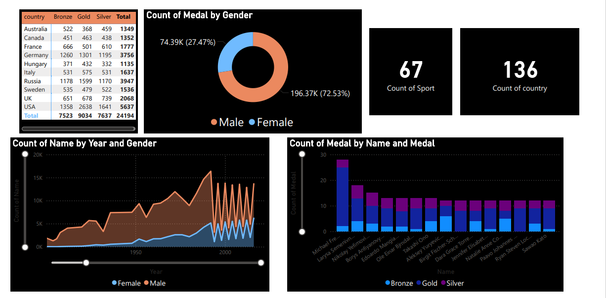

# Power_Bi_Projects
Here in this Folder I have uploaded my First Power Bi Project That is Based on Olympic Data Visualization
Steps: 
1)First import dataset in the Power Bi 
2)Secondly transform data in the Desired Format or Remove the unnecessary columns And Null Value 
3)Then Solve The Following Problem Statement Or Analyze It 
     a)Medals Won By Gender 
     b)Male and Female Ratio By Year 
     c)Top 10 countries By Medal 
     d)Top Olympic Meadlists by Total Medals 
     e)Total Number Of Participating Countries 
     f)Total Number Of sports

     

